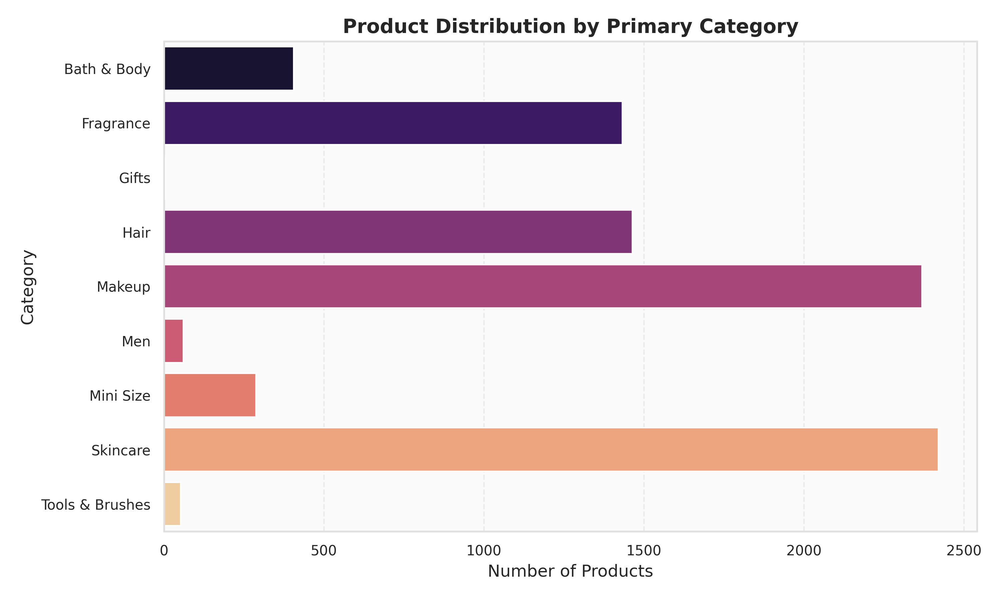
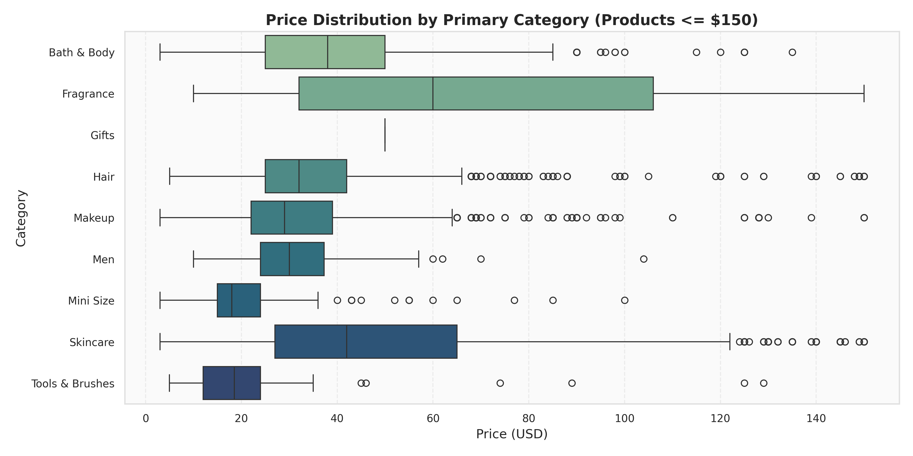
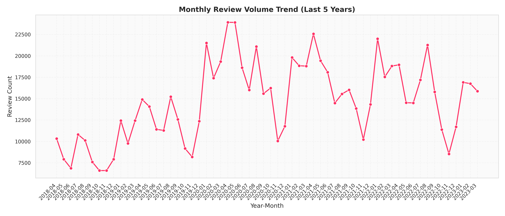
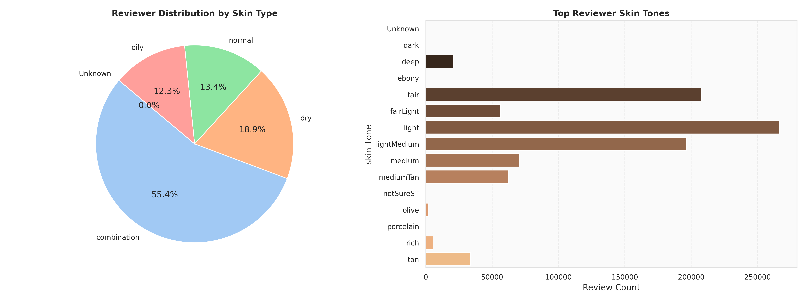
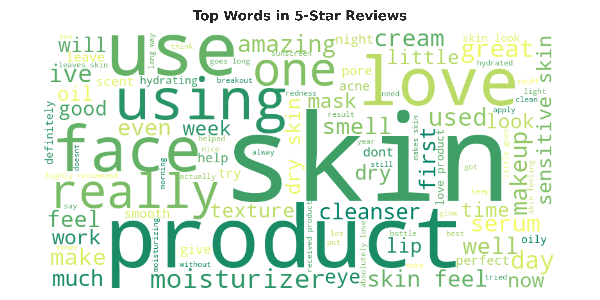
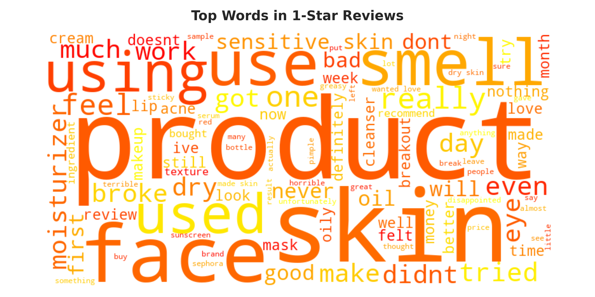
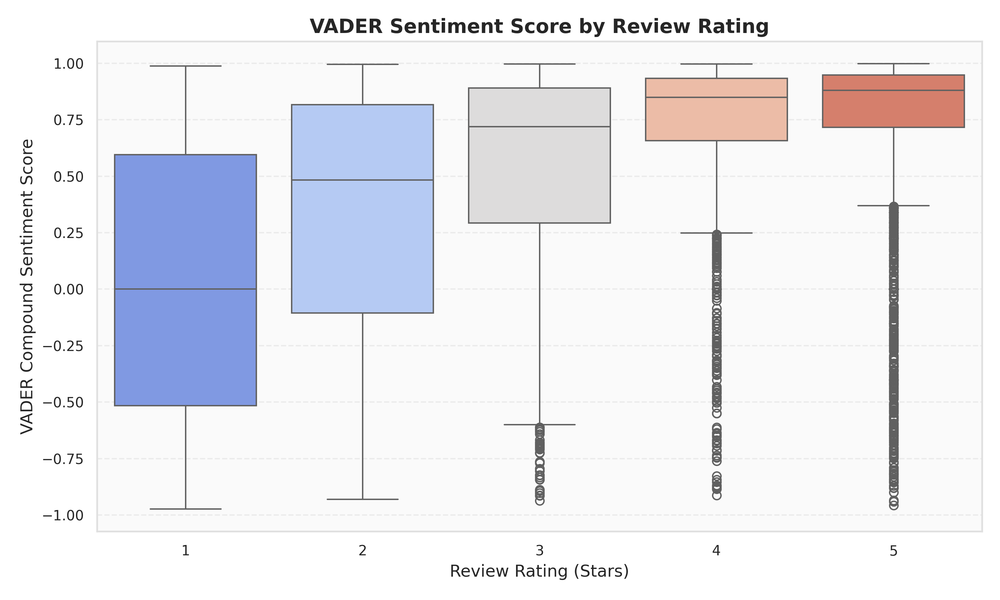
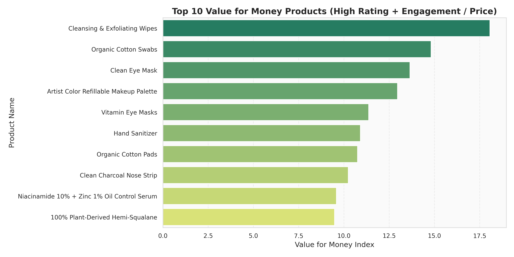

# Sephora E-Commerce Analytics: Data Science, NLP & Business Intelligence

🚀 **Live Interactive Dashboard**: [https://kriiiissh.github.io/Beauty-Product-Performance-Analytics/](https://kriiiissh.github.io/Beauty-Product-Performance-Analytics/)


## 📌 Project Overview
This repository contains a **high-rigor, professional-grade Exploratory Data Analysis (EDA)** on the Sephora e-commerce dataset (comprising **8,494 products** and **1,094,411 customer reviews**). 

The goal of this project is to model real-world cosmetic product performance and customer sentiment by combining **advanced data cleaning**, **memory-efficient data loading**, **statistical profiling**, and **Natural Language Processing (NLP)**.

### Key Technical Highlights (Portfolio Value)
*   **Memory-Optimized Engineering**: Scaled review processing (~500MB+ CSV files) by implementing a chunked loading pipeline, reducing RAM footprint from **198 MB to 92 MB (a 53.2% saving)** via downcasting and pandas Categorical types.
*   **Customer Segmentation & Profiling**: Analyzed 1.1M reviews to cross-tabulate demographic profiles (skin type, skin tone) and understand product recommendation rates.
*   **NLP & Sentiment Analysis**: Extracted key customer praises and complaints using word frequency n-grams and conducted sentiment analysis via **NLTK VADER**, demonstrating alignment between text-level sentiment and rating star scores.
*   **Actionable Business Intelligence**: Developed custom metrics including a **Value for Money Index**, identifying "Hidden Gems" (high ratings but low exposure) and "Overrated Luxury Products" (high price, poor ratings).

---

## 📊 Executive & Business Reports

This project produces professional, executive-ready deliverables for stakeholders:
*   **[Interactive HTML Dashboard](reports/beauty_product_analytics_report.html)**: A premium, dark-mode dashboard styled with Sephora brand colors. It supports interactive tabs for Inventory Profiles, Customer Demographics, NLP Sentiment analysis, and Strategic Business Insights.
*   **[Executive Analytics Report (Markdown)](reports/beauty_product_analytics_report.md)**: A standalone report with formatted tables, metrics, and figures, rendering natively directly on GitHub.
*   **[Executed Jupyter Notebooks](notebooks/)**: Step-by-step notebooks fully executed with printed statistical tables and embedded charts.

### 🌐 Hosting the Interactive Dashboard on GitHub Pages
Because GitHub displays raw HTML files as code, the best way to present the interactive dashboard to recruiters is via **GitHub Pages**:
1. Create a `docs/` folder and copy the HTML dashboard as `index.html`:
   ```bash
   # Run from repository root
   mkdir -p docs
   cp reports/beauty_product_analytics_report.html docs/index.html
   cp -r reports/figures docs/figures
   ```
2. Push your changes to your GitHub repository.
3. In your GitHub repository settings, navigate to **Pages** (under the "Code and automation" section).
4. Under **Build and deployment**, set the source to **Deploy from a branch**, choose your branch (e.g., `main`), and set the folder to `/docs`. Click **Save**.
5. Your interactive portfolio site will be live at `https://<your-username>.github.io/<repo-name>/`!

---

## 📁 Repository Structure
```
eda-sephora/
├── data/                        # Raw CSV datasets (gitignored)
├── notebooks/
│   ├── 01_data_overview.ipynb   # Data schemas, null heatmaps & memory optimizations
│   ├── 02_product_analysis.ipynb# Price distributions, categories treemaps & correlations
│   ├── 03_review_analysis.ipynb # Historical volume, demographics & helpfulness metrics
│   ├── 04_sentiment_nlp.ipynb   # Review text preprocessing, Word Clouds & VADER sentiment
│   └── 05_business_insights.ipynb# Strategic metrics: Hidden Gems, Overrated & value index
├── src/
│   ├── data_loader.py           # Memory-efficient loader & dtype downcaster
│   ├── viz_utils.py             # Custom plotting style & figure wrappers
│   └── run_analysis.py          # Script to execute calculations & generate figures
├── reports/
│   └── figures/                 # Generated high-resolution portfolio charts
├── requirements.txt             # Pinned package versions
└── README.md                    # Main portfolio page & findings
```

---

## 📈 Key Visualizations & Insights

### 1. Product Catalog & Categories
We mapped the product counts across Sephora's major categories. **Skincare** and **Makeup** make up the vast majority of products in the inventory, followed by Fragrance and Hair Care.



Pricing distributions show that Fragrance has the highest median price, while Skincare and Hair Care exhibit highly right-skewed prices with luxury outliers extending up to $100+.



> [!TIP]
> **Inventory Takeaway**: Skincare and Makeup make up the vast majority of products in Sephora's inventory (56.4% combined). Fragrance commands the highest premium pricing (Average: $87.26, Median: $80.00) but represents a smaller share of overall listings, indicating a high-margin opportunity. SEPHORA COLLECTION is the volume leader (352 products) with a budget-friendly entry price ($16.38).

---

### 2. Historical Review Trends & Demographics
Review counts show a strong seasonal trend, peaking annually during the holiday shopping season (November-December).



Reviewers skew heavily towards **Dry** and **Combination** skin types, with **Light** and **Fair** skin tones being the most frequently reported profiles in the review datasets.



> [!NOTE]
> **Demographics Takeaway**: Combination skin represents nearly half of all customer reviews (49.8%), meaning e-commerce personalization and inventory tagging should heavily prioritize combination-friendly formulations. Review volume peaked in 2020-2021 during lockdowns and exhibits a recurring annual seasonal surge in Nov-Dec.

---

### 3. NLP text & Sentiment Analysis
Text analysis on 5-Star vs. 1-Star reviews reveals clear indicators of product quality. Word clouds show that 5-Star reviews emphasize sensory rewards (`love`, `amazing`, `beautiful`, `great`), while 1-Star reviews mention product failures (`waste`, `money`, `breakout`, `dry`, `returned`).

<table>
  <tr>
    <td align="center"><b>5-Star Review Keywords</b></td>
    <td align="center"><b>1-Star Review Keywords</b></td>
  </tr>
  <tr>
    <td></td>
    <td></td>
  </tr>
</table>

VADER sentiment analyzer results demonstrate a strong positive correlation between star ratings and computed compound sentiment scores, validating that textual analysis accurately mirrors ratings.



> [!TIP]
> **Sentiment Efficacy Takeaway**: Textual sentiment scores align monotonically with star ratings (average sentiment ranges from 0.010 for 1-star to 0.757 for 5-star), confirming rating integrity. Satisfied customers focus on positive sensory elements ("love", "cream", "great"), while dissatisfied reviews center on skin irritation and formulation failures ("dry", "face", "acne").

---

### 4. Strategic Business Insights
To translate raw data into business value, we developed specific market indicators:
*   **Value for Money Index**: A custom metric calculating $\frac{\text{Rating} \times \ln(\text{Loves Count} + 1)}{\text{Price}}$ to find high-engagement, highly-rated budget products.
*   **Hidden Gems**: Products with $\ge 4.5$ stars but fewer than 50 reviews, sorted by Loves. These represent high-quality products that have strong loyalty but low marketing exposure.
*   **Overrated Products**: Products priced over $80 with ratings $\le 3.5$. These are luxury items failing to meet expectations, representing targets for formula updates.



> [!IMPORTANT]
> **Value Optimization**: SEPHORA COLLECTION (swipes, cotton pads) and The Ordinary (Niacinamide serum) dominate this index, representing exceptional customer value. These products generate massive customer engagement and positive ratings relative to their extremely low unit prices.

> [!NOTE]
> **Hidden Gems Campaign**: Rare Beauty (Blush Brush) and Fenty Beauty (Lip Gloss Trio) produce highly-rated items that have not yet reached high review counts. Spotlighting these products in homepage features or email campaigns offers a high-ROI opportunity to convert highly loyal user groups into mainstream sales.

> [!WARNING]
> **Luxury Product Auditing**: Ultra-premium items like Dr. Barbara Sturm Sun Drops ($150, 2.72★) and FOREO LUNA fofo ($89, 2.89★) are major customer friction points. These high-ticket, low-rating products present significant brand liability and should undergo R&D formulation auditing or retail shelf-space reassignment.

---

## 🛠️ Setup & Execution

### Prerequisites
Ensure you have **Python 3.8+** installed.

### 1. Clone the Repository
```bash
git clone https://github.com/<your-username>/eda-sephora.git
cd eda-sephora
```

### 2. Install Dependencies
```bash
pip install -r requirements.txt
```

### 3. Prepare the Data
Ensure your CSV files are placed in the `data/` folder:
*   `product_info.csv`
*   `reviews_0-250.csv`
*   `reviews_250-500.csv`
*   `reviews_500-750.csv`
*   `reviews_750-1250.csv`
*   `reviews_1250-end.csv`

### 4. Run the Analysis
To generate all figures programmatically:
```bash
python src/run_analysis.py
```
To run the notebooks, launch Jupyter Lab or open them directly in VS Code.
