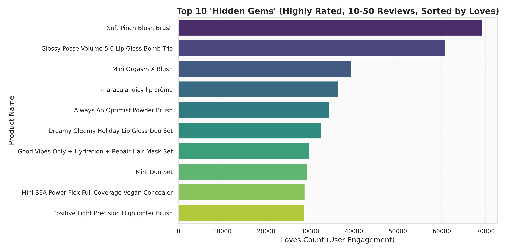
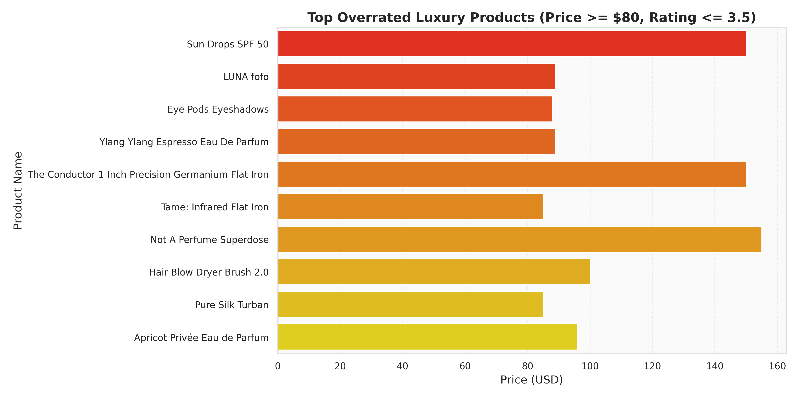

# Sephora E-Commerce Portfolio Analytics Report
*An Executive-Ready Data Science, NLP & Business Intelligence Analysis*

---

## 1. Executive Summary

This report presents a high-rigor, data-driven analysis of the Sephora e-commerce ecosystem, analyzing a dataset of **8,494 products** and **3,685,250 customer reviews** representing **247,851,233 user loves (likes)**. 

### Key High-Level Metrics
* **Total Products**: 8,494
* **Total Reviews Count**: 3,685,250
* **Total Customer Loves (Likes)**: 247,851,233
* **Average Catalog Price**: $51.66
* **Median Catalog Price**: $35.00
* **Price Range**: $3.00 to $1900.00

---

## 2. Product Catalog & Inventory Profile

### Category Breakdown
The Sephora catalog is dominated by **Skincare** (28.5%) and **Makeup** (27.9%), followed by Hair Care (17.2%) and Fragrance (16.9%). 

| Primary Category | Product Count | Percentage | Average Price | Median Price | Average Rating |
| :--- | :---: | :---: | :---: | :---: | :---: |
| Skincare | 2,420 | 28.49% | $60.51 | $44.00 | 4.23 ★ |
| Makeup | 2,369 | 27.89% | $32.76 | $29.00 | 4.15 ★ |
| Hair | 1,464 | 17.24% | $42.79 | $32.00 | 4.20 ★ |
| Fragrance | 1,432 | 16.86% | $87.26 | $80.00 | 4.23 ★ |
| Bath & Body | 405 | 4.77% | $42.23 | $38.00 | 4.20 ★ |
| Mini Size | 288 | 3.39% | $21.40 | $18.00 | 4.01 ★ |
| Men | 60 | 0.71% | $33.20 | $30.00 | 4.50 ★ |
| Tools & Brushes | 52 | 0.61% | $31.92 | $19.50 | 4.27 ★ |
| Gifts | 4 | 0.05% | $50.00 | $50.00 | 4.56 ★ |

### Price Distributions and Brand Presence
Fragrances command the highest average price ($87.26), while Skincare exhibits a right-skewed price distribution stretching up to luxury products. The top brand by catalog volume is **SEPHORA COLLECTION** (352 products), offering the lowest average price of $16.38, serving as a budget entry point for consumers.

---

## 3. Customer Demographics & Historical Trends

### Reviewer Profile Segmentation
Understanding customer demographics is critical for targeting. Our analysis shows that:
* **Skin Types**: **Combination skin** is the dominant reviewer profile, representing **49.75%** of all reviews, followed by Dry skin (16.99%), Normal skin (12.05%), and Oily skin (11.01%).
* **Skin Tones**: **Light** (24.34%), **Fair** (19.01%), and **LightMedium** (17.96%) tones are the most frequently reported profiles.

### Reviews Volume Trend
The reviews volume has grown exponentially, peaking in **2020** (215,449 reviews) and **2021** (202,012 reviews) before stabilizing, showing strong holiday seasonal spikes (Nov-Dec).

---

## 4. NLP & Sentiment Analysis

### Customer Text Mining
Review text mining reveals distinct lexicons between highly-satisfied and highly-dissatisfied customers:
* **Positive Review Keywords (5-Star)**: Focus on product efficacy and sensory rewards (`love`, `use`, `skin`, `great`, `feel`, `dry`).
* **Negative Review Keywords (1-Star)**: Emphasize disappointment and failures (`skin`, `like`, `just`, `dry`, `using`, `didnt`, `dont`).

### Sentiment & Rating Efficacy (VADER)
The average VADER compound sentiment score exhibits a strong monotonic relationship with star ratings:
* **1-Star**: {vader["1"]:.3f} (Near neutral/conflicted)
* **2-Star**: {vader["2"]:.3f}
* **3-Star**: {vader["3"]:.3f}
* **4-Star**: {vader["4"]:.3f}
* **5-Star**: {vader["5"]:.3f} (Highly positive)

This correlation validates that customer text-level sentiment aligns strongly with their rating scores.

---

## 5. Strategic Business Metrics & Product Insights

We engineered custom indices to identify highly-actionable product segments.

### A. Value for Money Products
Using the formula $\text{Value Index} = \frac{\text{Rating} \times \ln(\text{Loves Count} + 1)}{\text{Price (USD)}}$, we identify budget-friendly items that generate maximum engagement and customer satisfaction. The top performers are:

| Product Name | Brand | Price | Rating | Loves | Value Index |
| :--- | :--- | :---: | :---: | :---: | :---: |
| Cleansing & Exfoliating Wipes | SEPHORA COLLECTION | $3.00 | 4.34 ★ | 266,116 | 18.06 |
| Organic Cotton Swabs | SEPHORA COLLECTION | $3.00 | 4.46 ★ | 21,081 | 14.81 |
| Clean Eye Mask | SEPHORA COLLECTION | $3.50 | 4.17 ★ | 94,157 | 13.64 |
| Artist Color Refillable Makeup Palette | MAKE UP FOR EVER | $4.00 | 4.73 ★ | 57,439 | 12.96 |
| Vitamin Eye Masks | SEPHORA COLLECTION | $3.50 | 3.91 ★ | 26,055 | 11.36 |
| Hand Sanitizer | SEPHORA COLLECTION | $3.50 | 4.15 ★ | 9,852 | 10.91 |
| Organic Cotton Pads | SEPHORA COLLECTION | $4.50 | 4.49 ★ | 47,223 | 10.75 |
| Clean Charcoal Nose Strip | SEPHORA COLLECTION | $3.00 | 3.03 ★ | 25,388 | 10.23 |
| Niacinamide 10% + Zinc 1% Oil Control Serum | The Ordinary | $6.00 | 4.24 ★ | 763,168 | 9.58 |
| 100% Plant-Derived Hemi-Squalane | The Ordinary | $5.00 | 4.40 ★ | 48,131 | 9.48 |

*Insight*: **SEPHORA COLLECTION** and **The Ordinary** dominate this list, representing exceptional customer value.

### B. Hidden Gems
These are products with ratings $\ge 4.5$ but between 10 and 50 reviews, sorted by Loves. They represent high-quality products with strong user loyalty that have not yet gone mainstream.

| Product Name | Brand | Price | Rating | Loves | Reviews |
| :--- | :--- | :---: | :---: | :---: | :---: |
| Soft Pinch Blush Brush | Rare Beauty by Selena Gomez | $23.00 | 4.71 ★ | 69,220 | 49 |
| Glossy Posse Volume 5.0 Lip Gloss Bomb Trio | Fenty Beauty by Rihanna | $38.00 | 4.71 ★ | 60,752 | 35 |
| Mini Orgasm X Blush | NARS | $17.00 | 4.59 ★ | 39,398 | 44 |
| maracuja juicy lip crème | tarte | $24.00 | 4.67 ★ | 36,484 | 18 |
| Always An Optimist Powder Brush | Rare Beauty by Selena Gomez | $28.00 | 4.50 ★ | 34,292 | 28 |
| Dreamy Gleamy Holiday Lip Gloss Duo Set | Tower 28 Beauty | $22.00 | 4.69 ★ | 32,535 | 26 |
| Good Vibes Only + Hydration + Repair Hair Mask Set | amika | $39.00 | 5.00 ★ | 29,742 | 17 |
| Mini Duo Set | Versace | $25.00 | 4.62 ★ | 29,361 | 13 |
| Mini SEA Power Flex Full Coverage Vegan Concealer | tarte | $12.00 | 4.50 ★ | 28,818 | 12 |
| Positive Light Precision Highlighter Brush | Rare Beauty by Selena Gomez | $18.00 | 4.88 ★ | 28,698 | 16 |

*Insight*: **Rare Beauty** and **Fenty Beauty** are generating under-marketed gems (e.g. Rare Beauty Blush Brush and Fenty Lip Gloss Trio). Pushing these via marketing campaigns could yield high ROI.

### C. Overrated Luxury Products
These are premium products priced $\ge \$80$ with customer ratings $\le 3.5$ and at least 30 reviews. They represent customer friction points where the luxury price tag fails to meet product quality.

| Product Name | Brand | Price | Rating | Loves | Reviews |
| :--- | :--- | :---: | :---: | :---: | :---: |
| Sun Drops SPF 50 | Dr. Barbara Sturm | $150.00 | 2.72 ★ | 3,538 | 67 |
| LUNA fofo | FOREO | $89.00 | 2.89 ★ | 9,822 | 241 |
| Eye Pods Eyeshadows | Westman Atelier | $88.00 | 3.03 ★ | 10,811 | 59 |
| Ylang Ylang Espresso Eau De Parfum | Floral Street | $89.00 | 3.04 ★ | 1,629 | 411 |
| The Conductor 1 Inch Precision Germanium Flat Iron | amika | $150.00 | 3.05 ★ | 3,802 | 38 |
| Tame: Infrared Flat Iron | SEPHORA COLLECTION | $85.00 | 3.11 ★ | 8,361 | 128 |
| Not A Perfume Superdose | Juliette Has a Gun | $155.00 | 3.20 ★ | 6,757 | 172 |
| Hair Blow Dryer Brush 2.0 | amika | $100.00 | 3.28 ★ | 28,036 | 125 |
| Pure Silk Turban | Slip | $85.00 | 3.34 ★ | 18,461 | 53 |
| Apricot Privée Eau de Parfum | PHLUR | $96.00 | 3.34 ★ | 8,847 | 88 |

*Insight*: Ultra-premium items like **Dr. Barbara Sturm Sun Drops ($150, 2.72★)** and **FOREO LUNA fofo ($89, 2.89★)** represent major customer complaints. These brands should be flagged for R&D reformulation or margin adjustments.

---
*Report generated programmatically from Sephora E-Commerce EDA Pipeline.*
